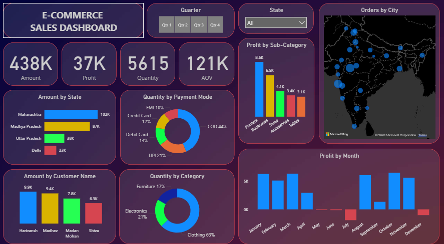

# E-COMMERCE SALES ANALYSIS

Brief exploratory data analysis of e-commerce sales data (orders and details).

**Repository files:**
- **Orders.csv** — order-level records (columns include `Order ID`, `Order Date`, `CustomerName`, `State`, `City`).
- **Details.csv** — transaction/product-level details for orders (open the file to see exact columns).

## Purpose
Provide a small dataset and example workflows for exploring sales by geography, time, and customers.

## Dashboard preview

## Project overview

This repository contains a Power BI dashboard of an E-commerce store used to answer questions about sales performance, geography, customers, and trends. Insights generated by the dashboard are collected in the `results.txt` file.

### Installation

To run this project on your machine you need to install Microsoft Power BI Desktop (available from Microsoft). Open the provided Power BI (.pbix) file in Power BI Desktop to view and interact with the dashboard.

### Conclusion

The project successfully answered questions about the E-commerce store's performance. See `results.txt` for the detailed insights and conclusions.
